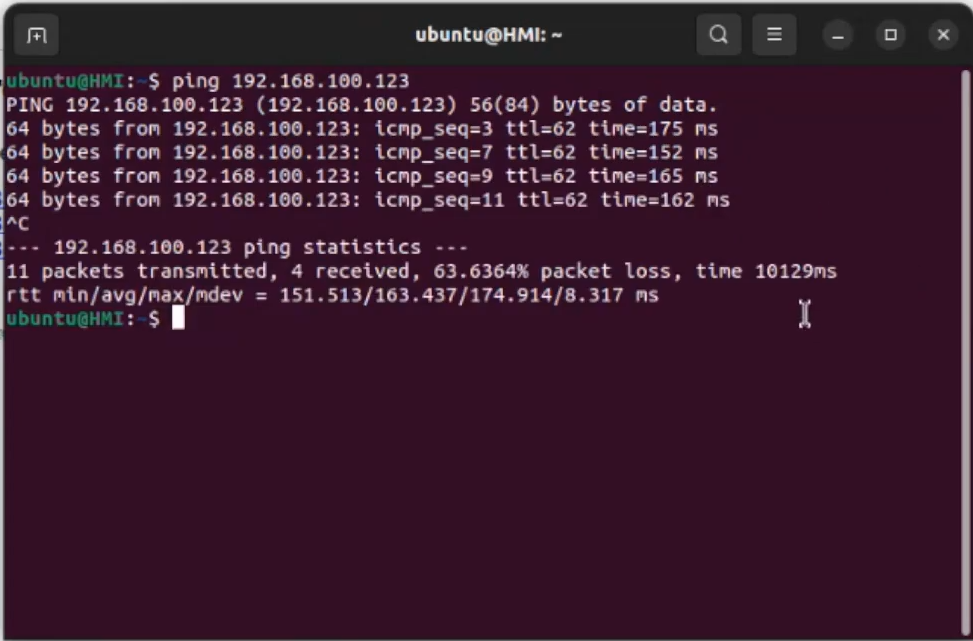

# Renewable Energy and Storage Cybersecurity Research Experiment


The Renewable Energy and Storage Cybersecurity Research (RESCue) project is a collaborative effort aimed at securing the rapidly growing deployment of transmission-connected hybrid renewable energy systems, consisting of a combination of wind, solar, and/or energy storage equipment, against escalating cyber threats. This project brings together major original equipment manufacturers (OEMs) of wind, solar, and energy storage, along with major asset owners and DOE National Laboratories, to collectively identify cyber threats, assess risks, and develop robust cybersecurity strategies and solutions. The development of hybrid reference architectures has provided comprehensive blueprints for the secure design and integration of hybrid renewable energy systems, accounting for their unique characteristics and interdependencies. Additionally, NREL has created a cyber-resilient design framework that integrates cybersecurity considerations from the start of the system lifecycle, ensuring security is "baked in" from the initial design phase.

The research thrusts for the project included (i) development of hybrid reference architectures and (ii) a cyber-resilient  design framework for hybrid energy systems. The reference architectures has provided comprehensive blueprints for the secure design and integration of hybrid renewable energy systems, accounting for their unique characteristics and interdependencies. Additionally, NREL has created a cyber-resilient design framework that integrates cybersecurity considerations from the start of the system lifecycle, ensuring security is "baked in" from the initial design phase. A demonstration experiment was developed for one of the architectures using NREL's Cyber Range resources. This experiment configuration, deployable using open-source tools, is provided here in this repository. Additional models were developed for the wind and solar architectures as well, however the configurations for only the Energy Storage scenario are provided here.[^1]

## Experiment Demonstration Scenarios

The developed reference architecture was also used to demonstrate three different attack scenarios, and how the implementation of the framework can be used to eliminate/mitigate these threats. These scenarios are:

1. Secure by default: This experiment shows the attacker trying to access a device in the network using a default password, but unable to get access.

2. Cloud connection: This experiment shows the disruption of the cloud service connected to the hybrid plant controller via a distributed denial of service  attack, which is mitigated by utilizing a combination of monitoring and segmentation.

3. Interdependent equipment failure: This experiment shows the impact of interdependent systems by flipping a breaker via fire-suppression-system affecting power generation. This is mitigated by utilizing a pre-configured response scheme.

### Secure by default

1. To Demonstrate this attack, attempt to log into the HMI from an attacker. A login screen will appear that looks similar to what is shown below:


2. At this point, if the (non-default) credentials are not available to the attacker, they will attemt to log in and be blocked due to incorrect credentials, demonstrating how non-default credentials can be a very simple line of defense against attackers.

### DoS of Cloud Connection

1. To Demonstrate this attack, first the cloud service may be opened from the HMI to see the responsiveness. It looks like what is shown below:


2. A ping to the cloud service's IP address may also be initiated at this time to confirm the low latency between the site and the service. An example of this is shown below:


3. To begin the attack, the attackers all run an hping3 commmand to flood their connections to the cloud. An example from an individual attacker is shown below:


4. To confirm the cloud service is experiencing a denial of service (DoS), a refresh of trhe page on the HMI will show the lack of responsiveness and the inability to load large objects such as images due to the high latency of the connection. This might look like what is shown below:


5. This may also be verified with another ping to the cloud service IP address. The increased latency should be instantly apparent, as seen below:


6. Once the attackers cease the flooding of the connection, the connection to the service will be immediately restored.

### Impact of Insecure credentials

1. To Demonstrate this attack, first the attacker logs into the HMI using the known credentials. Once logged in, they are able to issue malicous commands directly, such as flipping a Breaker. It looks like what is shown below:


2. After several seconds, the impact of this malicous command is seen in the output of the Battery system dropping to 0. On the HMI, it looks like what is shown below:


## Experiment Architecture

The Battery Energy Storage System (BESS) plant includes an environmental control system which is unique to energy storage. There are large concerns over DC arcs and safety of battery storage due to the safety hazards of the materials. A battery management system is unique to this infrastructure as it controls the battery modules and sends the data to a battery controller and/or energy management system. The BESS power plant is a stand-alone design to be operated independently to both supply energy to the grid during peak demand hours and to absorb excess energy at other times.

### Experiment Architecture Diagram


### Experiment Architecture Description

The BESS plant set up in this demonstration has several integral components that make up the overall system.

* Human Machine Interface (HMI) : This element allows for monitoring and control of the system

* Energy Management System (EMS): This element is a high-level controller that manages the whole system

* Battery Controllers (RTUs) : These elements manage individual Battery storage arrays in the plant

* Fire Supression System : This element monitors and actuates the plant's fire suprpession system.

* Smart Meter and Breaker Controller : This element monitors the power, voltage and current flowing between the grid and the plant. It is also able to disconnect the plant from the grid if needed.

* Cloud Service : This service is called on by the EMS and may be also seen on the HMI. This service is considered to be on the internet and not on the site network

### Deployed Architecture in Phenix


## Experiment Demonstration video


## Requirements

A hardware resource with [Phenix](https://phenix.sceptre.dev/latest/) installed. The hardware requirements to run this experiment are:

* Minimum - 6-core CPU, 16GB RAM, 64GB HDD
* Recommended - 12-core CPU, 32GB RAM, 128GB SSD

## How to deploy

This guide assumes the user has a basic understanding of deploying experiments in Phenix and how to use the graphical interface as well as work with topology and scenario configuration files. Please reference [the docs](https://phenix.sceptre.dev/latest/) to learn more.

1. Clone this repository locally to the /phenix directory (or wherever phenix is installed. This guide assumes the base is /phenix) using git and upload the configurations into to Phenix.

2. Build the necessary images using the phenix image build process described [here](https://phenix.sceptre.dev/latest/image/)
   An example build command is shown below:

   ```bash
    phenix image build -x -o /phenix/images/ otsim-opnsrc | tee otsim-buildlog.log
    ```

3. Create a new experiment with the newly added topology and scenario configurations, then start the experiment.

## Contacts

This code was authored by Adarsh Hasandka (adarsh.hasandka@nrel.gov) and Sivasathya Pradha Balamurugan (sbalamur@nrel.gov)
under the US Department of Energy (DoE) Office of Cybersecurity, Energy Security, and Emergency Response (CESER) funded project RESCue, which was led by Danish Saleem (danish.saleem@nrel.gov). For any questions or comments, please reach out to Danish or Adarsh

## References

[^1]: [Saleem, Danish, Charles Magill, Venkatesh Venkataramanan, Zoe Dormuth, Adarsh Hasandka, and Emily Waligoske. 2024. RESCue Pilot Final Report. Golden, CO: National Renewable Energy Laboratory. NREL/TP-5T00-89921.](https://www.nrel.gov/docs/fy24osti/89921.pdf)